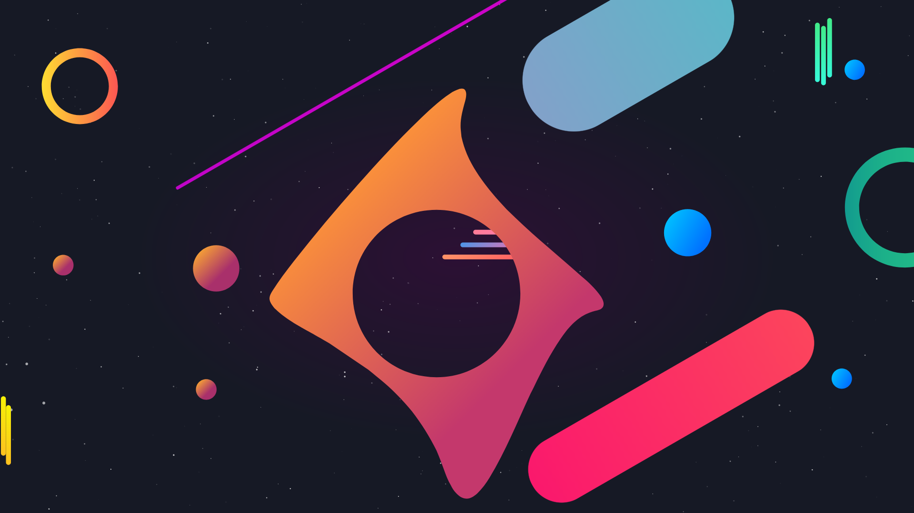

# SweetKDE Lively

A web page created with [GSAP](https://github.com/greensock/GSAP) and [Particles.js](https://github.com/VincentGarreau/particles.js) for [Lively Wallpaper](https://github.com/rocksdanister/lively) inspired by Eliver Lara's [SweetKDE Wallpaper](https://store.kde.org/p/1309907/).

## [Demo](https://venombigbozz.github.io/SweetKDE-Lively/)

## [MIT License](LICENSE)
